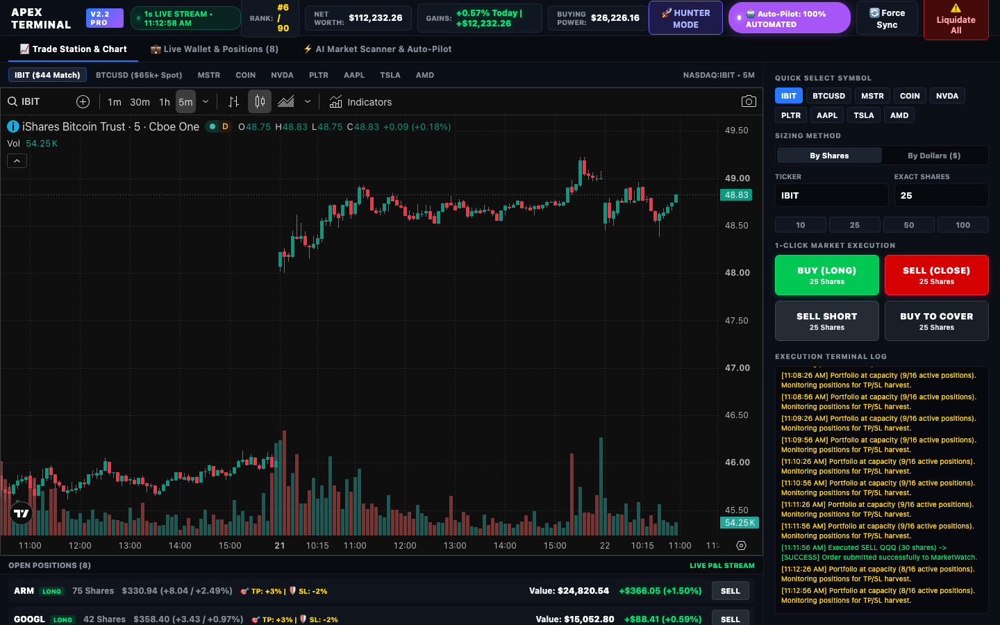

# mwvse-trading-panel

algorithmic trading workstation, automated market scanner, and autonomous position supervisor for the MarketWatch Virtual Stock Exchange (VSE).



i built this because manual day-trading on MarketWatch's web UI during high-velocity volatility is painfully slow, clunky, and prone to slippage. this panel gives you a high-frequency trading desk with TradingView charting, 1-click execution, and an **autonomous algorithmic engine** that actively scans for breakout momentum, auto-enters high-conviction setups, and protects your capital with dynamic take-profit and stop-loss trailing cuts.

> **disclaimer**: this is an independent, educational open-source project. it is **not affiliated, associated, authorized, endorsed by, or in any way officially connected with MarketWatch, Dow Jones & Company, Inc.**, or any of their subsidiaries or affiliates. provided **"as is"** without warranty of any kind.

---

## what you need

- python 3.10+
- a mac or linux machine (windows works with wsl)
- a MarketWatch account participating in any Virtual Stock Exchange game
- chromium (installed automatically via playwright)

---

## setup

```bash
git clone https://github.com/ghostwwn/mwvse-trading-panel.git
cd mwvse-trading-panel
python3 -m venv venv
source venv/bin/activate
pip install -r requirements.txt
playwright install chromium
```

or simply use the automated 1-click launcher:

```bash
./run.sh
```

---

## attaching your account (foolproof & dummy-proof)

attaching your MarketWatch account takes 10 seconds and requires zero cookie extraction or token tampering:

```bash
python main.py setup
```

1. **paste your game URL**: paste your full tournament URL (e.g. `https://www.marketwatch.com/games/my-game-fall-2026`) or just the slug. the wizard parses it automatically.
2. **interactive 1-click login**: the wizard will open a browser window. log in to MarketWatch with Google, Apple, or email. 
3. **auto-save**: as soon as you're logged in, the wizard detects your authenticated session, writes your `.env`, and saves your profile to `user_data/`. you never have to log in again.

you can verify your environment at any time with:

```bash
python main.py doctor
```

---

## usage

```bash
# 1. launch the full web trading workstation + autonomous supervisor
python main.py run

# 2. launch mobile station on wi-fi with qr code camera pairing
python main.py mobile

# 3. launch the rich terminal tui (live dashboard in your console)
python main.py terminal

# 4. run the standalone autonomous algorithmic trader
python main.py auto

# 5. print an instant snapshot of your net worth, rank, and positions
python main.py status

# 6. run environment diagnostics
python main.py doctor
```

web dashboard will be live at `http://127.0.0.1:8000/`.

---

## mobile version (iphone & android)

to trade and supervise positions from your phone:

```bash
python main.py mobile
```

- **camera pairing**: points your terminal to your local Wi-Fi IP and renders an ASCII QR code. point your iPhone or Android camera at the screen to open the mobile workstation in 1 second.
- **touch-first fintech ux**: Robinhood/TradingView mobile layout with fixed bottom navigation (`Wallet`, `Chart`, `Trade`, `Auto`, `Feed`), 1-tap position liquidation, and mobile charting.
- **native app feel (pwa)**: tap **Share $\rightarrow$ Add to Home Screen** on Safari/Chrome to run it in full-screen standalone mode with no browser URL bar!
- **auto-detection**: any mobile device loading `http://<ip>:8000/` is automatically served the mobile station.

---

## how it works (roughly)

1. **headless browser execution**: uses playwright with persistent user profiles to execute `BUY`, `SELL`, `SELL SHORT`, and `BUY TO COVER` orders directly into the VSE engine.
2. **confluence momentum scanner**: continuously evaluates a tournament universe of high-beta tech leaders (`TSLA`, `TQQQ`, `NVDA`, `MSTR`, `ARM`, `PLTR`, etc.) for breakout volume, EMA crossovers, and resistance breaks.
3. **autonomous auto-entry**: automatically sizes and queues market entries for qualifying setups ($\ge 75\%$ confidence) while strictly enforcing position limits and per-ticker cooldowns.
4. **autonomous risk guardian**: evaluates open positions every 15 seconds. triggers automatic market liquidations on take-profit spikes (+2.5% to +3.5%) or stop-loss drawdowns (-2.0%).
5. **anti-caching live scraper**: fetches tournament rankings and wallet metrics with cache-busting timestamps (`_cb=<ts>`) and `no-cache` HTTP headers to prevent stale DOM reads.

---

## tradingview webhooks

you can link any TradingView strategy or alert to trade automatically:

1. in your TradingView alert, set the Webhook URL to:
   ```
   http://YOUR_SERVER_IP:8000/webhook
   ```
2. set the alert message to:
   ```json
   {
     "secret": "your_webhook_secret_here",
     "ticker": "{{ticker}}",
     "action": "buy",
     "shares": 25
   }
   ```
pre-built PineScript templates are included in the [`pinescript/`](pinescript/) folder.

---

## troubleshooting

| problem | thing to try |
|---------|--------------|
| "insufficient buying power" | MarketWatch requires margin to short. keep buying power free or trim 1x index holdings |
| "not logged in" | run `python main.py setup` and log in via the browser window |
| playwright browser missing | run `playwright install chromium` or `python main.py doctor` |
| webhook 403 forbidden | make sure the `secret` in your alert matches `WEBHOOK_SECRET` in `.env` |
| game slug invalid | check your URL on marketwatch.com/games/ — the slug is the part after `/games/` |

---

## config

all tunables can be configured in `.env` or passed via CLI:

- `MW_GAME_SLUG`: your MarketWatch tournament slug
- `AUTOPILOT_STRATEGY`: `HUNTER` (momentum breakouts), `SNIPER` (tight scalps), or `BALANCED`
- `AUTOPILOT_ACTIVE`: `true` or `false` (can be toggled live via Web UI)
- `AUTOPILOT_SCAN_INTERVAL`: seconds between market breakout scans (default `30`)
- `AUTOPILOT_HARVEST_INTERVAL`: seconds between TP/SL portfolio sweeps (default `15`)
- `MAX_CONCURRENT_POSITIONS`: maximum concurrent positions held (default `10`)
- `ALLOCATION_PER_TRADE_DOLLARS`: dollar allocation per autonomous entry (default `$15,000.00`)

---

## anti-skid & attribution

this project is open source under the MIT license. if you fork, adapt, or build upon this project, preserve original copyright notices and attribution to `@ghostwwn`. don't skid.

---

## license

mit — do whatever you want with it, but don't strip credits.

---

built by [@ghostwwn](https://github.com/ghostwwn)
